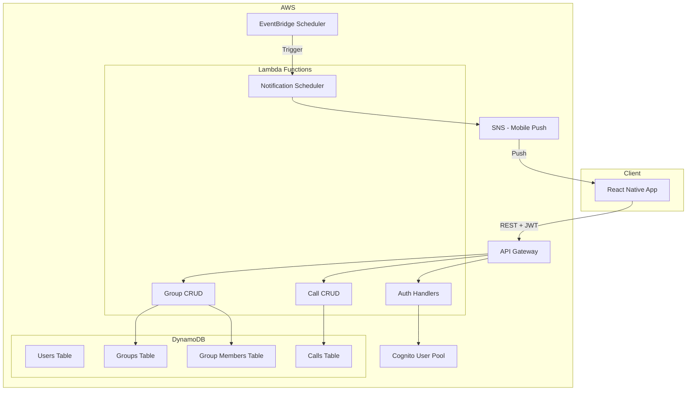

# Fireside

An app to help friends keep track of regularly scheduled calls. Create groups, add members, and schedule one-time or recurring calls with push notification reminders.

## Architecture Overview

## Project Structure

- **backend/** — Lambda + API code (handlers, lib, models)
- **frontend/** — React Native (Expo)
- **infrastructure/** — Terraform
- **.github/workflows/** — CI/CD pipelines

## Data Model (DynamoDB)

| Table         | Partition Key        | Sort Key | Purpose                                 |
| ------------- | -------------------- | -------- | --------------------------------------- |
| users         | userId (Cognito sub) | -        | User profile, device tokens for push    |
| groups        | groupId              | -        | Group name, createdBy                   |
| group_members | groupId              | userId   | Membership, invitedAt                   |
| calls         | callId               | -        | title, scheduledAt, recurrence, groupId |

**Recurrence schema**: Store as JSON (e.g., `{ "frequency": "weekly", "weekdays": [2], "time": "19:00" }`). Use EventBridge Scheduler to create recurring reminder jobs.

## Key Implementation Details

### 1. Backend (Node.js / TypeScript)

- **Runtime**: Lambda with Node 20, TypeScript compiled to single-file deploy (esbuild)
- **API**: API Gateway HTTP API (simpler than REST) with Lambda authorizer using Cognito JWT
- **Auth flow**: Cognito User Pool; frontend gets JWT; API validates via Lambda authorizer
- **Handler structure**: One Lambda per "domain" (groups, calls) or single Lambda with routing—recommend single Lambda with Express-like routing (e.g., `middy` or custom router) for fewer cold starts and simpler IaC

### 2. Push Notifications

- **Options**: (a) AWS SNS Mobile Push (APNs + FCM), or (b) Expo Push Notifications (simpler for React Native)
- **Recommendation**: Expo Push for MVP—less AWS config, works well with React Native/Expo
- **Reminder flow**: EventBridge Scheduler runs every 15 min; Lambda queries upcoming calls (next 30 min window); sends push via Expo Push API or SNS to registered device tokens

### 3. Infrastructure (Terraform)

- **Provider**: AWS (default), optionally `hashicorp/archive` for Lambda zip
- **Modules**: Keep flat initially (api, auth, db, notifications); split into modules if it grows
- **State**: S3 backend + DynamoDB lock (configure via `backend` block or env)
- **Outputs**: API URL, Cognito User Pool ID/Client ID for frontend config

### 4. GitHub Actions

- **Workflows**:
  - `deploy-infra`: On push to `main` in `infrastructure/`, run `terraform plan` (PR) / `apply` (merge)
  - `deploy-backend`: On push to `main` in `backend/`, build Lambda, deploy via Terraform or SAM/Serverless—recommend Terraform-managed Lambda to keep single source of truth
  - `build-frontend`: Build React Native (Expo) on PR; optional EAS Build for release binaries
- **Secrets**: `AWS_ACCESS_KEY_ID`, `AWS_SECRET_ACCESS_KEY` (or OIDC with OIDC); Terraform variables for stage (dev/staging/prod)

### 5. Frontend (React Native + Expo)

- **Expo**: EAS for builds; Expo Router for navigation
- **Auth**: `expo-auth-session` or `amazon-cognito-identity-js` for Cognito login/signup
- **API**: Fetch/axios with JWT in Authorization header
- **Push**: `expo-notifications` to request permission, get token, send to backend; store in `users` table
- **Screens**: Auth (login/signup), Groups list/create, Group detail + members, Calls list/create (with recurrence picker), Call detail

## Technology Choices Summary

| Layer  | Choice                | Rationale                                     |
| ------ | --------------------- | --------------------------------------------- |
| Lambda | Node 20 + TypeScript  | Familiar, fast cold starts, good DynamoDB SDK |
| API    | API Gateway HTTP API  | Cheaper, simpler than REST API                |
| Push   | Expo Push (MVP)       | Minimal setup; can migrate to SNS later       |
| RN     | Expo managed workflow | OTA updates, push built-in, simpler dev       |

## Phased Rollout

**Phase 0 (POC)**

- Create a basic React Native app
- Install and run on both iOS and Android devices

**Phase 1 (MVP)**

- Cognito sign-up/sign-in
- Groups: create, list, add members (by email—Cognito lookup)
- Calls: create one-time and recurring, list by group
- In-app display of upcoming calls; no push yet

**Phase 2**

- Device token registration; EventBridge + Lambda for reminders
- Push notifications 15 min before call

**Phase 3**

- Polish: edit/delete calls, leave group, improved recurrence UX

## Open Decisions

1. **Monorepo vs multi-repo**: Monorepo recommended—single PR can touch frontend + backend + infra.
2. **Terraform state**: Use remote S3 backend from the start; create bucket manually or via bootstrap script.
3. **Environments**: Start with `dev` only; add `staging`/`prod` when needed.
4. **Adding friends to groups**: MVP = invite by email; backend creates Cognito user if needed and adds to `group_members`. Simpler: require invitee to have account first; search by email to add.

## Getting Started

*Setup instructions to be added once the project structure is in place.*
